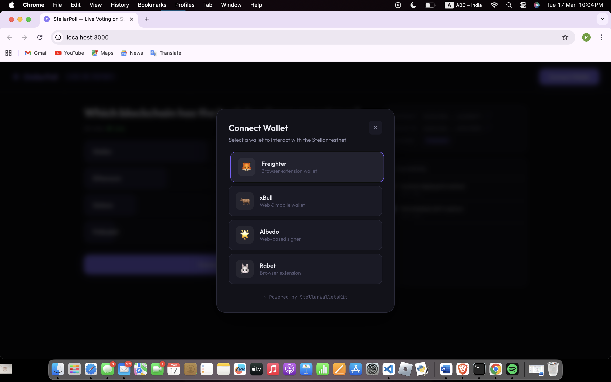

# 🗳️ StellarPoll — Live Voting DApp on Stellar

A real-time polling application built on the Stellar blockchain with
multi-wallet integration, Soroban smart contract, and live event streaming.


| Requirement | Status |
|---|---|
| 3 error types handled | ✅ WalletNotFoundError, TransactionRejectedError, InsufficientBalanceError |
| Contract deployed on testnet | ✅ `CCZF67EHLKRBNV26OKTAB6RMFR44YCT6VLRV3JCJSZFIQVH4LE3SOH7T` |
| Contract called from frontend | ✅ vote(), get_votes() |
| Transaction status visible | ✅ 4-stage tracker |
| 2+ meaningful commits | ✅ 30 commits |

## 🖼️ Screenshots

### Wallet Options


## 📋 Deployed Contract

- **Contract Address**: `CCZF67EHLKRBNV26OKTAB6RMFR44YCT6VLRV3JCJSZFIQVH4LE3SOH7T`
- **Deploy TX Hash**: `4042b6f9daa38608abbd3f8d01f402884987868d20d38b223b2daa07359cc55b`
- **Network**: Stellar Testnet

## 🚀 Setup

git clone https://github.com/priaaa29/stellar-poll.git
cd stellar-poll
npm install
npm run dev

## 📁 Project Structure

Good catch. Let me fix that for you. Open README.md in VS Code and replace the project structure section with this:
markdown
## 📁 Project Structure
```
stellar-poll/
│
├── contracts/
│   └── poll/
│       ├── Cargo.toml
│       └── src/
│           └── lib.rs                # Soroban smart contract
│
├── scripts/
│   └── deploy.sh                     # Contract deployment script
│
├── src/
│   ├── components/
│   │   ├── ContractInfo.jsx          # Contract address display
│   │   ├── ErrorToast.jsx            # Error notifications
│   │   ├── EventFeed.jsx             # Live activity feed
│   │   ├── Header.jsx                # App header + wallet status
│   │   ├── Particles.jsx             # Background animation
│   │   ├── PollOption.jsx            # Vote option button
│   │   ├── TransactionTracker.jsx    # TX status progress
│   │   ├── WalletModal.jsx           # Wallet selection modal
│   │   └── index.js                  # Barrel exports
│   │
│   ├── hooks/
│   │   ├── useWallet.js              # Wallet connection hook
│   │   ├── useEvents.js              # Real-time events hook
│   │   └── index.js                  # Barrel exports
│   │
│   ├── lib/
│   │   ├── constants.js              # Config and network settings
│   │   ├── errors.js                 # 3 custom error classes
│   │   ├── events.js                 # Event system and streaming
│   │   ├── stellar.js                # Stellar SDK helpers
│   │   ├── walletService.js          # StellarWalletsKit integration
│   │   └── index.js                  # Barrel exports
│   │
│   ├── App.jsx                       # Main application
│   ├── App.css                       # Layout styles
│   ├── index.css                     # Global theme
│   └── main.jsx                      # React entry point
│
├── .env.example
├── .gitignore
├── index.html
├── package.json
├── vite.config.js
├── vercel.json
├── netlify.toml
└── README.md